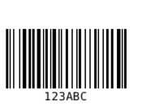
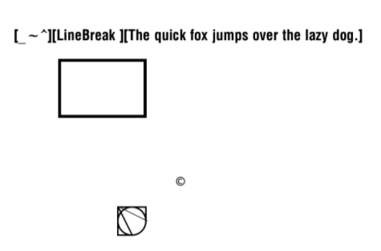
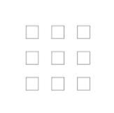

# ZPLUtility
A .net library helping to generate ZPL string.
Please refer to the Programming Guide for raw ZPL code definitaion, 
[ZPL Documentation](https://www.zebra.com/content/dam/zebra/manuals/printers/common/programming/zpl-zbi2-pm-en.pdf)
Some basic ZPL elements are included, if you have any suggestions please feel free to let me know.

## :information_source: Info
> :warning: Note we are changing the class name prefix, from `ZPLElement` in version 1.x to `ZplElement` in version 2.
> The documentation for the old version 1 is available [here](https://github.com/BinaryKits/ZPLUtility/tree/v1)


## How can I use it?

The package is available via [](https://www.nuget.org/packages/ZPLUtility)

| Package Manager | .NET CLI |
| ------------- | ------------- |
| ``` PM> install-package ZPLUtility ``` | ``` > dotnet add package ZPLUtility ``` |

## Is there a way to generate a preview?

Yes, you can test the generated ZPL code via http://labelary.com/viewer.html

## How can I send the generated data to my printer?

For example, the data can be transmitted to the printer IpAddress on port 9100.

```cs
var zplData = @"^XA^MMP^PW300^LS0^LT0^FT10,60^APN,30,30^FH\^FDSAMPLE TEXT^FS^XZ";
// Open connection
var tcpClient = new System.Net.Sockets.TcpClient();
tcpClient.Connect("10.10.5.85", 9100);

// Send Zpl data to printer
var writer = new System.IO.StreamWriter(tcpClient.GetStream());
writer.Write(zplData);
writer.Flush();

// Close Connection
writer.Close();
tcpClient.Close();
```

Also, a Virutal Printer for Zebra is available as [Chrome Plugin](https://chrome.google.com/webstore/detail/zpl-printer/phoidlklenidapnijkabnfdgmadlcmjo)

## Examples

### Using statement

```cs
using BinaryKits.ZplUtility;
using BinaryKits.ZplUtility.Elements;
```

### Single element

```cs
var output = new ZplGraphicBox(100, 100, 100, 100).ToZplString();
Console.WriteLine(output);
```

### Barcode

```cs
var output = new ZplBarcode128("123ABC", 10, 50).ToZplString();
Console.WriteLine(output);
```



### Whole label

```cs
var sampleText = "[_~^][LineBreak\n][The quick fox jumps over the lazy dog.]";
var font = new ZplFont(fontWidth: 50, fontHeight: 50);
var elements = new List<ZplElementBase>();
elements.Add(new ZplTextField(sampleText, 50, 100, font));
elements.Add(new ZplGraphicBox(400, 700, 100, 100, 5));
elements.Add(new ZplGraphicBox(450, 750, 100, 100, 50, LineColor.White));
elements.Add(new ZplGraphicCircle(400, 700, 100, 5));
elements.Add(new ZplGraphicDiagonalLine(400, 700, 100, 50, 5));
elements.Add(new ZplGraphicDiagonalLine(400, 700, 50, 100, 5));
elements.Add(new ZplGraphicSymbol(GraphicSymbolCharacter.Copyright, 600, 600, 50, 50));

// Add raw Zpl code
elements.Add(new ZplRaw("^FO200, 200^GB300, 200, 10 ^FS"));

var renderEngine = new ZplEngine(elements);
var output = renderEngine.ToZplString(new ZplRenderOptions { AddEmptyLineBeforeElementStart = true });

Console.WriteLine(output);
```



### Simple layout

```cs
var elements = new List<ZplElementBase>();

var origin = new ZplOrigin(100, 100);
for (int i = 0; i < 3; i++)
{
    for (int j = 0; j < 3; j++)
    {
        elements.Add(new ZplGraphicBox(origin.PositionX, origin.PositionY, 50, 50));
        origin = origin.Offset(0, 100);
    }
    origin = origin.Offset(100, -300);
}

var options = new ZplRenderOptions();
var output = new ZplEngine(elements).ToZplString(options);

Console.WriteLine(output);
```


### Auto scale based on DPI

```cs
var elements = new List<ZplElementBase>();
elements.Add(new ZplGraphicBox(400, 700, 100, 100, 5));

var options = new ZplRenderOptions { SourcePrintDpi = 203, TargetPrintDpi = 300 };
var output = new ZplEngine(elements).ToZplString(options);

Console.WriteLine(output);
```
### Render with comment for easy debugging

```cs
var elements = new List<ZplElementBase>();

var textField = new ZplTextField("AAA", 50, 100, ZplConstants.Font.Default);
textField.Comments.Add("An important field");
elements.Add(textField);

var renderEngine = new ZplEngine(elements);
var output = renderEngine.ToZplString(new ZplRenderOptions { DisplayComments = true });

Console.WriteLine(output);
```

### Different text field type

```cs
var sampleText = "[_~^][LineBreak\n][The quick fox jumps over the lazy dog.]";
var font = new ZplFont(fontWidth: 50, fontHeight: 50);

var elements = new List<ZplElementBase>();
// Special character is repalced with space
elements.Add(new ZplextField(sampleText, 10, 10, font, useHexadecimalIndicator: false));
// Special character is repalced Hex value using ^FH
elements.Add(new ZplTextField(sampleText, 10, 50, font, useHexadecimalIndicator: true));
// Only the first line is displayed
elements.Add(new ZplSingleLineFieldBlock(sampleText, 10, 150, 500, font));
// Max 2 lines, text exceeding the maximum number of lines overwrites the last line.
elements.Add(new ZplFieldBlock(sampleText, 10, 300, 400, font, 2));
// Multi - line text within a box region
elements.Add(new ZplTextBlock(sampleText, 10, 600, 400, 100, font));

var renderEngine = new ZplEngine(elements);
var output = renderEngine.ToZplString(new ZplRenderOptions { AddEmptyLineBeforeElementStart = true });

Console.WriteLine(output);
```

### Draw pictures, auto resize based on DPI (Please dither the colorful picture first)

You have 2 options:

#### 1. ZplDownloadObjects (Use ~DY and ^IM)
With this option, the image is sent to the printer in the original graphic format and the printer converts the graphic to a black and white graphic

```cs
var elements = new List<ZplElementBase>();
elements.Add(new ZplGraphicBox(0, 0, 100, 100, 4));
elements.Add(new ZplDownloadObjects('R', "SAMPLE.BMP", System.IO.File.ReadAllBytes("sample.bmp")));
elements.Add(new ZplImageMove(100, 100, 'R', "SAMPLE", "BMP"));

var renderEngine = new ZplEngine(elements);
var output = renderEngine.ToZplString(new ZplRenderOptions { AddEmptyLineBeforeElementStart = true, TargetPrintDpi = 300, SourcePrintDpi = 200 });

Console.WriteLine(output);
```

#### 2. ZplDownloadGraphics (Use ~DG and ^XG)
With this option, the image is converted from the library into a black and white graphic and the printer already receives the finished print data

```cs
var elements = new List<ZplElementBase>();
elements.Add(new ZplDownloadGraphics('R', "SAMPLE", System.IO.File.ReadAllBytes("sample.bmp")));
elements.Add(new ZplRecallGraphic(100, 100, 'R', "SAMPLE"));

var renderEngine = new ZplEngine(elements);
var output = renderEngine.ToZplString(new ZplRenderOptions { AddEmptyLineBeforeElementStart = true, TargetPrintDpi = 600, SourcePrintDpi = 200 });

Console.WriteLine(output);
```

## Alternative projects

| Language | Project |
| ------------- | ------------- |
| JavaScript | [JSZPL](https://github.com/DanieLeeuwner/JSZPL) |
| .NET | [sharpzebra](https://github.com/rkone/sharpzebra) |
| .NET | [PDFtoZPL](https://github.com/sungaila/PDFtoZPL) |
